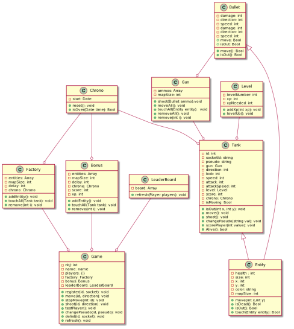

# l3_projet_etudiant


## Description 

This is the final project of our last year in Bachelor Degree in ULCO Calais.

## How to play 

Launch [this link(empty)]() to access the home page of the game.
Click on [the play button(empty)]() to access the game page, and click on [the controler(empty)]() to access the control page.
You have to use the control page on your mobile phone.
Use the joysticks to move and shoot towards a specific direction.

## functionalitys

* Each player **control** a tank.
* Chose a class and a name.
* Each tank can **move** and **aim** with the two joysticks.
* **Left** joystick to move.
* **Right** joystick to aim.
* Collect **green dots** to gain experience and score points.
* Collect **red hearth** to regain life point. 
* Upgrade your tank with your levels.
* Multiple canons.

## Development team  

* **Skibinski Pierre** :Project manager and in charge of the game engine.
* **Pecqueux Théo** :  In charge of the game controls.
* **Villette Vincent** : In charge of the networking process.
* **Huyghes Antoine** : Git master and in charge of the graphic part of the game.

## Development   

Each developer has a branch with their name. They can add their own modifications to this branch. When a developer want to put his code on the master branch and give it to everyone, he just have to create a **merge request** on the git respository. The git master just have to take a look on this request and validate it, or not.

## Install the game on local network 

```sh
# fork and clone project

# install
cd l3_projet_etudiant/
npm install

# serve at 'localhost:3000'
npm run devstart
```

## Run the tests

```sh
# install
cd test/
npm install

# run
npm run test
```

## Class diagram  



## Conclusion 


