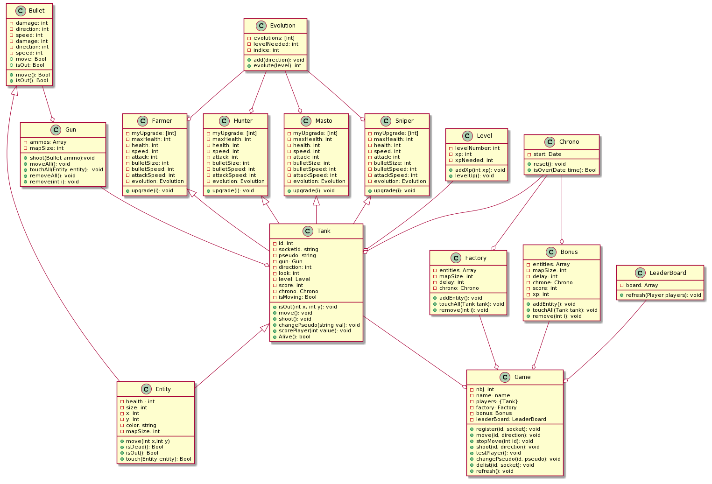

# l3_projet_etudiant


## Description 

This is the final project of our last year in Bachelor Degree in ULCO Calais.
This is a browser game with mobile controler. 
Directed by [M.Leprêtre](https://florian-lepretre.herokuapp.com/) and [M.Dubois](https://www.linkedin.com/in/dubois-amaury-6b976310b/?originalSubdomain=fr).
* [The project instructions](https://florian-lepretre.herokuapp.com/teaching/projetl3/consignes)

## How to play 

Go on [our website](http://stanks-io.herokuapp.com/) to access the home page of the game.
Click on [the play button](http://stanks-io.herokuapp.com/game) to access the game page, and click on [the controler](http://stanks-io.herokuapp.com/controls) to access the control page.
You have to use the control page on your mobile phone.
Chose a name and a tank class (description by clicking on ) and then, use the joysticks to move and shoot towards a specific direction.
**Your main objectif: kill the other tanks.**

A good game description is available by clicking on  on the the home page.

## Functionalitys

* Each player **control** a tank.
* Chose a class and a name.
* Each tank can **move** and **aim** with the two joysticks.
* **Left** joystick to move.
* **Right** joystick to aim.
* Collect **green dots** to gain experience and score points.
* Collect **red hearth** to regain life point. 
* Upgrade your tank with your levels. They are different according to the class.
* Multiple tank evolutions.
* Climb the leaderboard to show your skill.

## Development team  

* **Skibinski Pierre** :Project manager and in charge of the game engine.
* **Pecqueux Théo** :  In charge of the game controls.
* **Villette Vincent** : In charge of the networking process.
* **Huyghes Antoine** : Git master and in charge of the graphic part of the game.

## Development   

Each developer has a branch with their name. They can add their own modifications to this branch. When a developer want to put his code on the master branch and give it to everyone, he just have to create a **merge request** on the git respository. The git master just have to take a look on this request and validate it, or not.
We can help each others if someone is stuck on a problem for to long.

Different versions of the game: 
* [V1.0](https://gitlab.com/huyghes-antoine/l3_projet_etudiant/-/tags/v1.0)
* [V2.0](https://gitlab.com/huyghes-antoine/l3_projet_etudiant/-/tags/V2.0)
* [V3.0](https://gitlab.com/huyghes-antoine/l3_projet_etudiant/-/tags/V3.0) 
* [V4.0](https://gitlab.com/huyghes-antoine/l3_projet_etudiant/-/tags/V4.0)

## Install the game on local network and run the tests

**The game**
```sh
cd l3_projet_etudiant/
npm install
npm run devstart
#Run on localhost:3000
```
**The tests**
```sh
cd test/
npm install
npm run test
```

## Class diagram  



* [Previous diagram](img/diag.png)

## Conclusion 

* Self-critism : 
    * Not enough organisation at the begining of the project.
    * Everyone was working on the same things. 
    * But at the end of the first / second day, everyone was focus on his own objectives for the project. 
    * Maybe we should have spend more time on the *project management*.
    * But our branch organisation was perfect for us. 
    * That's new to us to create something from A to Z and it's a good source of experience for the futur.

* If we had to redo it : 
    * Keep the same developer team, we had good communications and it was fun to do. 
    * Chose another game to make. The snake was our second choice to be honest. 

*Thanks to our teachers for this project*